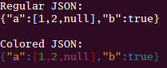

# colorjson

Print JSON in color.

This library has two methods: `Print` and `Parse`.

`Print`: takes a string of JSON and an `io.Writer` and writes the characters of the JSON
string surrounded by appropiate ANSI color codes to the writer.

`Parse`: is a lower level function that takes a callback function and gives it each Token.
Unlike other parsers, these tokens contain only a single rune of the initial string.
